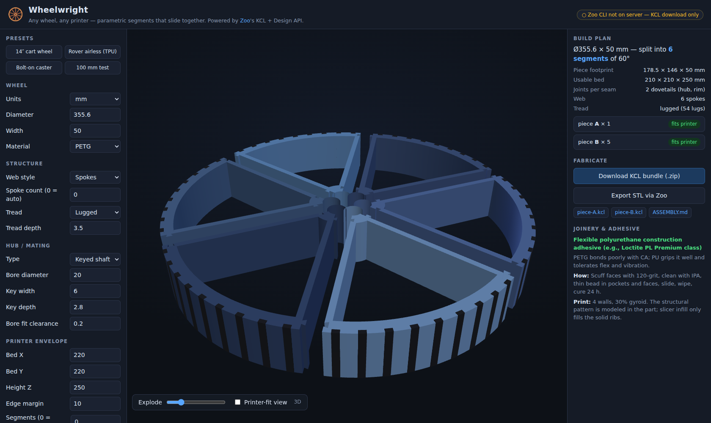
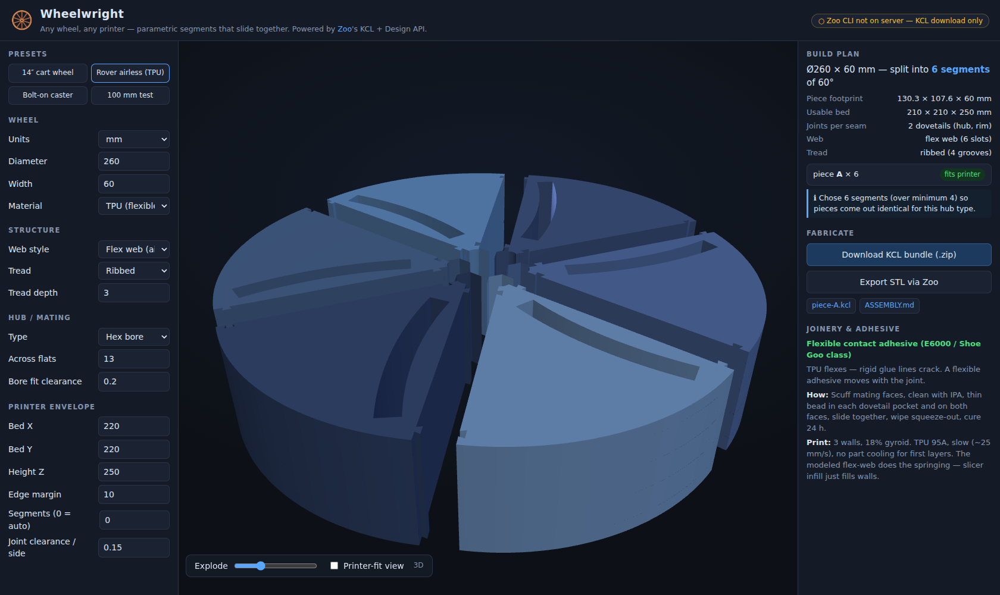
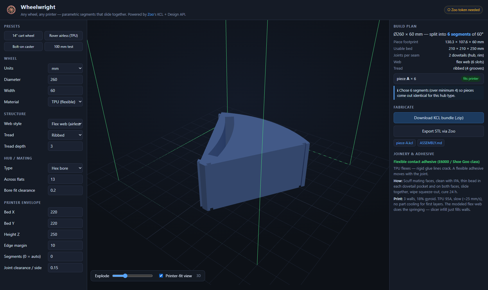
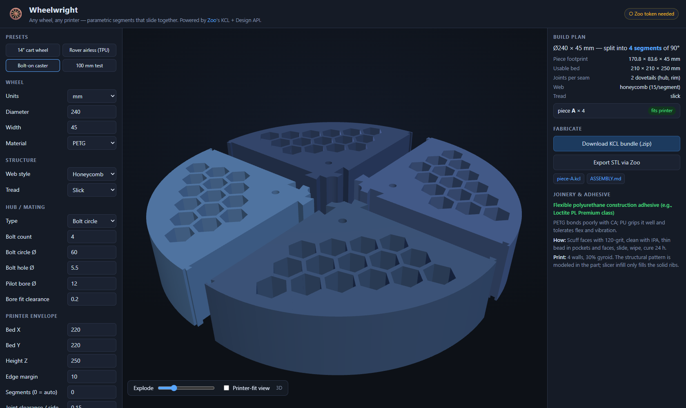

# 🛞 Wheelwright

**Any wheel, any printer.** A parametric configurator for 3D-printable wheels that automatically
splits the wheel into segments that fit *your* printer's build volume and slide together with
dovetail joints — no CAD required. Built for the [Zoo](https://zoo.dev) API makeathon: every
configuration compiles to ready-to-run **KCL**, and Zoo's engine turns it into STLs.

Want a 14″ airless tire for your cart project but only own an Ender-sized printer? Type in the
wheel you want and the envelope you have; Wheelwright hands you the pieces, the print settings,
and the glue-up instructions.



## What it does

- **Configure the wheel**: diameter, width, material (PLA/PETG/ABS/TPU), tread (lugged / ribbed /
  diamond / slick), and hub interface (keyed shaft, plain, hex, D-bore, or bolt circle with pilot).
- **Pick a web**: solid, spokes, or one of the four [airless patterns](#the-airless-webs) —
  honeycomb, interlaced lattice, auxetic re-entrant, or voronoi. Each carries its own parameter
  group (cell size, wall, orientation, corner rounding…) and each guarantees a minimum wall
  everywhere, by construction.
- **Give it your print envelope**: bed X/Y, height Z, edge margin.
- **It plans the build**: picks the smallest segment count whose pieces fit the bed, sizes
  slide-together dovetails into the rim and hub rings, keeps structural webs clear of the seams,
  and dedupes pieces — a keyed 6-segment wheel is "print A×1, B×5", not six different files.
- **It generates KCL**: one file per unique piece, in Zoo's modern solver-sketch dialect, lying
  print-flat on XY. Plus a generated `ASSEMBLY.md` (print settings, adhesive choice, glue-up
  steps) and a JSON manifest.
- **Zoo makes the STLs**: one click on a server with the [Zoo CLI](https://zoo.dev/docs/developer-tools/cli)
  + `ZOO_API_TOKEN`, or open the `.kcl` files in [Zoo Design Studio](https://zoo.dev/design-studio)
  and export there.

| Airless TPU rover wheel (flex-web, hex bore) | Printer-fit check against your envelope |
|---|---|
|  |  |

## Quickstart

```sh
npm install
npm start          # http://localhost:3000
```

Optional, for one-click STL export from the UI — two steps:

```sh
npm run setup:zoo       # downloads the Zoo CLI for your platform into ./bin
cp .env.example .env    # then set ZOO_API_TOKEN (https://zoo.dev/account/api-tokens)
npm start
```

…or click the **Zoo status pill** (top right in the app) and paste a token there. A pasted
token lives in that browser's localStorage only and rides each request in an `x-zoo-token`
header — the server uses it per-request and never stores or logs it. `.env` / `.env.local`
are loaded by a tiny dependency-free loader (real environment variables always win), and the
CLI is found via `PATH`, `ZOO_CLI_PATH`, or a `./bin/zoo` drop-in.

Without the CLI/token the app still does everything except server-side STL conversion — you
download the KCL bundle and run `zoo kcl export --output-format=stl piece-A.kcl .` yourself, or
export from Design Studio.

```sh
npm test           # 105 unit tests: chunking math, joints, dedupe, piece profiles, every web pattern's wall and overlap guarantees, KCL well-formedness
npm run validate:kcl   # regenerates a 13-config matrix; round-trips through Zoo's engine when a token is set
```

## Documentation

| Doc | What's in it |
|---|---|
| [User guide](docs/user-guide.md) | Install, every control, reading the build plan, six worked use-cases, printing and glue-up, troubleshooting. |
| [Architecture](docs/architecture.md) | The planner's geometry: band model, segment solver, dedupe, the chart the curved webs are drawn in, KCL emission rules, testing strategy. |
| [HTTP API](docs/api.md) | `/api/plan`, `/api/kcl`, `/api/kcl.zip`, `/api/export/stl`, the parameter object, error codes. |
| [Zoo platform field notes](docs/zoo-api-notes.md) | Bug reports, friction and suggestions for Zoo's APIs — with minimal repros, measured timings, and the workaround shipped for each. |

## How it works

```
  browser form ──► planWheel()  (src/lib/wheel.js — pure JS, runs in browser AND server)
                      │
                      ├─ segment-count solver (annular-sector bbox vs. usable bed, prefers
                      │  counts that make pieces identical for your hub's symmetry)
                      ├─ dovetail sizing (rim ring + hub ring; clearance per side)
                      ├─ web layout (spokes, flex-web slots, or a honeycomb /
                      │  lattice / auxetic / voronoi cell pattern), kept clear
                      │  of seam keep-outs so joints stay solid
                      ├─ tread cutters (circumferential groove rings, axial lug slots —
                      │  pattern counts snap to multiples of N so seams land between features)
                      └─ per-piece hub features + signature dedupe (keyway/D-flat/bolt windows)
                      │
        ┌─────────────┴──────────────┐
        ▼                            ▼
  Three.js preview            KCL generator (src/lib/kclgen.js)
  (same plan, exploded        one .kcl per unique piece +
  view + printer-fit view)    ASSEMBLY.md + manifest
                                     │
                                     ▼
                          Zoo engine (zoo kcl export / Design Studio) ──► STLs
```

One geometry plan feeds both the preview and the code generator, so what you see is what the
engine builds. Everything is derived on configure — there is no model library.

### The segmentation scheme

Segments are annular wedges cut by radial seams. Each seam carries **axial slide dovetails**
(trapezoidal tenon on one face, clearance pocket on the other) placed in the solid rim ring and
hub ring, so all pieces slide together along the axle direction and any piece can be inserted
last. Dovetails resist the circumferential separation; axial retention comes from the adhesive
(plus hub bolts, when you pick a bolt-circle hub). Because the tenon/pocket geometry is part of
each piece's 2D outline, the generated KCL needs nothing beyond sketches, regions, extrudes and
subtracts — the most battle-tested ops in the engine.

For keyed, hex and D hubs the wedges extend inward past the bore line and the bore tool is
subtracted per piece, so the assembled hub carries the exact mating feature with your chosen fit
clearance. Concentric round bores (plain, and the bolt hub's pilot) skip that trim: each sector
outline carries its exact arc of the bore circle directly, because asking the engine to shave the
razor-thin concentric sliver is a boolean its solver rejects ("cannot handle this 3D subtraction
yet"). Bolt holes are still subtracted per piece.

### Why the pieces come out identical

Feature-aware deduplication: the planner computes which segment windows intersect the keyway /
D-flat / bolt holes and hashes each piece's canonical feature set. The segment-count solver
prefers (within fit constraints) counts that match the hub's rotational symmetry — e.g. hex
bores like 2/3/6/12 segments — so most wheels are "print one file N times". Bolt circles are
phase-rotated to sit centred between the seams for the chosen N, so no piece ever carries a
half-open hole.



The patterned webs cooperate: every cell is placed clear of the seam keep-outs and repeats per
segment, so a web never costs you a unique piece and never leaves a joint half-cut.

## The airless webs

Search "airless tire" and you get four looks: honeycomb, criss-crossing curved struts, chevron
trusses, and the auxetic lattices out of the research papers — plus the organic voronoi webs the
3D-printing crowd likes. Wheelwright models all of them. Pick a web style in the sidebar and its
own parameter group appears; every length follows the units selector.

| Style | The look | Knobs |
|---|---|---|
| `honeycomb` | Hex cells on a true hex lattice — the Polaris/Resilient NPT look. | [below](#honeycomb) |
| `lattice` | Two mirrored families of struts crossing in an X, diamonds slung between them. One row degenerates to a chevron/V-truss. | [below](#interlaced-lattice) |
| `auxetic` | Re-entrant bow-tie cells in a brick bond: the web pulls *inward* when you squeeze it. | [below](#auxetic-re-entrant) |
| `voronoi` | Organic irregular cells from a seeded tessellation. | [below](#voronoi) |

### How the curved ones are built

Honeycomb is a straight lattice stamped onto an annulus. The other three curve with the wheel, and
they all get there the same way — by unrolling the web band into a rectangle, drawing the pattern
there in plain straight-line geometry, and mapping it back:

```
  Φ(θ, t) = polar(rWebIn + t·bandW, θ)      θ ∈ [0, A] degrees,  t ∈ [0, 1] across the band
```

Φ is injective on the strip and orientation-preserving, so **cells laid out disjoint in the chart
come out disjoint on the wheel** — the same no-overlap guarantee the hex lattice gets for free,
extended to patterns that bend. That matters: overlapping cells merge into open voids in the CAD
and shred the preview's triangulation.

What Φ *does* distort is distance — one degree of θ buys `r·π/180` mm of arc, more the further out
you go — so every wall is converted to degrees at the innermost radius it touches, which makes the
number you typed the **minimum** material anywhere along that wall. Two consequences worth knowing:

- A leaning strut is thicker measured tangentially than it is across itself, so `strutWidth` is
  taken as the **perpendicular** thickness and the lattice gives up `strutWidth / cos φ` of arc for
  it. Fall out of that: the neck between the cells above and below a crossing works out to
  `strutWidth / sin φ` — never the tighter of the two, so it never needs policing.
- Curves are emitted as chords, and a chord falls *inside* the arc it replaces. On a cell's inner
  boundary that eats into the wall, so the chord length is held under `√(8·r·sag)` and every wall
  carries the leftover sag as an allowance.

The tests measure all of it on the finished millimetre geometry — every pair of cells in 31
configurations, checked for overlap, nesting, self-crossing loops, band containment, seam
clearance, and the wall actually left between them.

### Honeycomb

| Option | Default | What it does |
|---|---|---|
| `cellSize` | `0` (auto) | Cell width across flats. Auto sizes cells to the web band (band ÷ 8, 4–12 mm circumradius). |
| `wall` | `2.6` mm | Material left between neighbouring cells — the same everywhere by construction. |
| `orientation` | `radial` | `radial` points a cell vertex at the rim; `tangential` turns the whole lattice 30° so a flat faces it. |
| `cellShape` | `hex` | `round` replaces each hex with its inscribed circle — same lattice, same walls, no stress-raising corners. |
| `cornerRadius` | `0` (sharp) | Fillets the hex corners. Capped at half the across-flats width, where the cell becomes `round`. |
| `maxCells` | `64` | Per-segment cell budget. Cells are grown until they fit it, keeping the KCL (and the boolean count) sane. |

### Interlaced lattice

Two pencils of straight lines in the chart, `θ = c ± L·t`, crossing on `rows + 1` evenly spaced
levels. The diamond centred on each crossing spans one strut pitch across and two levels up, and
levels stagger by half a pitch. Two rows and up weave; one row leaves alternating triangles — a
chevron truss.

| Option | Default | What it does |
|---|---|---|
| `rows` | `0` (auto) | Diamond rows across the band; `1` gives the chevron/V-truss. Auto scales with the band width. |
| `struts` | `0` (auto) | Struts per family around the whole wheel, snapped to a multiple of the segment count. Auto picks roughly square cells. |
| `strutWidth` | `4` mm | Material between neighbouring cells, measured across the strut. |
| `cornerRadius` | `1.5` mm | Fillets the cell corners — the sharp apexes of a flexing web are where it cracks. |

### Auxetic (re-entrant)

Hexagonal cells whose two waist vertices are pulled back *inside* the cell, so under load the ribs
fold instead of stretching and the web draws inward as it is squeezed — a negative Poisson's ratio,
which is why the pattern keeps turning up in airless-tire research. Cells sit on concentric rings,
brick-staggered ring to ring, all sharing one angular pitch so the columns line up.

| Option | Default | What it does |
|---|---|---|
| `rings` | `0` (auto) | Cell rings across the band. Auto aims at ~26 mm of band per ring. |
| `cellSize` | `0` (auto) | Cell width at the ring's mid radius. Auto matches the ring height. Rings near the hub narrow their cells rather than turn into a few big lobes. |
| `wall` | `3` mm | Material between neighbouring cells — exactly this radially, and this at the tightest point of every ring wall. |
| `waist` | `0.45` | Waist width ÷ cell width. Lower pinches harder (more auxetic); `0.9` is nearly a plain hex. |
| `cornerRadius` | `1.2` mm | Fillets the corners, waist included — a rounded waist bows into the wall, so the bow is capped at the slack that corner has. |

### Voronoi

A seeded tessellation of the unrolled band: jittered-grid seeds, two rounds of Lloyd relaxation to
even them out without making them look machined, then every cell pulled back by half a wall. The
pull-back is metric-aware per edge — both owners of a shared edge run the same numbers off the same
edge, so the two half-walls add up exactly.

| Option | Default | What it does |
|---|---|---|
| `cells` | `0` (auto) | Cells per segment. Auto sizes them to the band; the automatic count stops at 40, but you can ask for up to 120. |
| `wall` | `3` mm | Material between neighbouring cells. |
| `seed` | `1` | Same seed, same web. Nothing in the planner touches `Math.random()`, so a design is reproducible on the server and in the browser. |
| `cornerRadius` | `1.2` mm | Fillets the cell corners. |

Ask for cells too small for the budget and the planner grows them and says so in the build notes;
ask for cells too big for the web band and it leaves the web solid rather than half-cutting the
rim. Segmented wheels keep every cell clear of the seam keep-outs, so the joints stay solid — on a
narrow wedge near the hub that can mean a ring or two is left solid, and the notes say which.

## Adhesive guidance (the flexible-glue question)

The app recommends per material, and bakes it into the generated `ASSEMBLY.md`:

- **TPU** — flexible contact adhesive (E6000 / Shoe Goo class); rigid glue lines crack on a
  flexing tire.
- **PETG / PLA** — flexible polyurethane construction adhesive (Loctite PL Premium class): wheels
  live with shock and vibration, and slightly-flexible PU beats brittle CA. Epoxy if you want
  maximum stiffness.
- **ABS/ASA** — acetone solvent weld for a near-monolithic wheel, or PU where impact matters.

Thin bead in each dovetail pocket and along both faces, slide, wipe, cure 24 h. Dry-fit first —
the default 0.15 mm/side joint clearance suits most printers and is tunable.

## The generated KCL

Modern solver-sketch dialect, pinned to `kclVersion = 1.0` (the same pin Zoo's shipping samples
use), with exact precomputed coordinates — nothing for the solver to solve, nothing ambiguous
for the engine:

```kcl
@settings(defaultLengthUnit = mm, kclVersion = 1.0)

outlineSk = sketch(on = XY) {
  e1 = line(start = [9.2, 0], end = [16.346, 0])
  ...
  e10 = arc(start = [177.8, 0], end = [88.9, 153.9793], center = [0, 0])
  ...
}
blank = extrude(region(point = [86.9983, 50.2285], sketch = outlineSk), length = 50)

cut1Sk = sketch(on = offsetPlane(XY, offset = -1)) {
  c1 = circle(start = [10.2, 0], center = [0, 0])
}
cut1 = extrude(region(segments = [cut1Sk.c1]), length = 52)
...
piece = subtract([blank], tools = [cut1, cut2, ...])
```

Cutters overshoot the part in Z, boolean tool batches are bounded, and arcs are emitted
start/end/center in CCW order per the KCL spec — with their endpoints snapped onto a common
radius, because an arc whose endpoints disagree by a micron is rejected by the engine as a bad
*region query point* ([WW-3](docs/zoo-api-notes.md#ww-3--a-1-µm-arc-inconsistency-is-reported-as-a-bad-region-query-point)).

## API

Everything the UI does is plain JSON over HTTP:

| Endpoint | What |
|---|---|
| `POST /api/plan` | Full geometry plan (segments, joints, warnings, per-piece cutters) |
| `POST /api/kcl` | Generated files as JSON |
| `POST /api/kcl.zip` | KCL bundle download |
| `POST /api/export/stl` | STL bundle via the Zoo engine (503 + instructions if CLI/token missing) |
| `GET /api/health` | Zoo CLI/token status |

Request body = the same parameter object the form produces (all fields optional; see
`DEFAULTS` in [`src/lib/wheel.js`](src/lib/wheel.js)).

## Repo layout

```
server.js               express: static UI + API + Zoo export proxy
src/lib/wheel.js        the planner (pure, shared browser/server)
src/lib/units.js        unit switching: rewrites the form so lengths keep their physical size
src/lib/kclgen.js       KCL emitter + assembly guide generator
src/lib/zoo.js          zoo CLI wrapper for KCL → STL
src/lib/zip.js          dependency-free ZIP writer
src/lib/env.js          dependency-free .env / .env.local loader
public/                 UI (vanilla JS + vendored three.js, 2D canvas fallback)
scripts/setup-zoo.mjs   downloads the Zoo CLI for your platform into ./bin
scripts/validate-kcl.js engine round-trip validation for a config matrix
test/                   node:test suite
```

## Honest limitations & roadmap

- Very large wheels on very small printers hit a pie-slice depth limit (piece depth ≈ wheel
  radius). The fix is a second split ring (tire ring + hub ring as separate dovetailed
  assemblies) — planned, warned about today.
- Wheel width taller than the printer Z is warned, not yet auto-split axially.
- Tread/tenon edges are sharp (no chamfered lead-ins yet); slicers' seam-aware placement and a
  light file fix the first-fit experience.
- Preview approximates tread visually; the KCL carries the exact cuts.
- **Engine export is not yet reliable enough to be the only route.** In a 13-configuration
  live run on engine 0.2.186 (2026-08-05), 5 configs exported, 3 hung with no output until our
  300 s timeout, and 5 returned engine errors — one of which was ours and is now fixed. Runtime
  doesn't track model size either: we measured a 12-entity file at 417 s and a 69-cutter wheel
  at 85 s. Every measurement, repro and suggested fix is in
  [docs/zoo-api-notes.md](docs/zoo-api-notes.md); the KCL download and Design Studio remain the
  dependable path, which is why they're first-class in the UI.
- Wishlist: Text-to-CAD hub-cap emblems ("a snarling wolf, embossed"), mass/inertia estimates
  via Zoo's file API, chamfered joint lead-ins, per-piece print-time estimates.

## License

MIT — see [LICENSE](LICENSE).

Vendored third-party code under `public/vendor/` (three.js and `OrbitControls`) is MIT
licensed by the three.js authors and keeps its own copyright notice.
